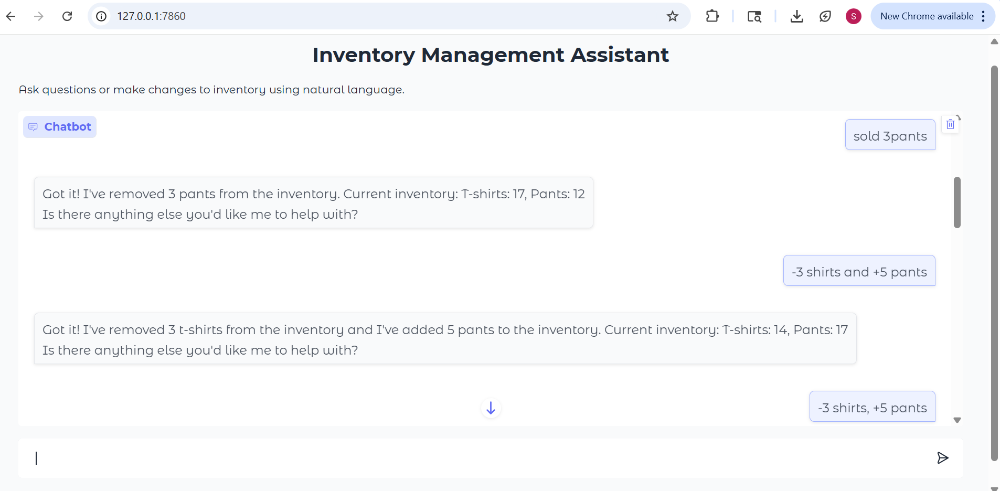
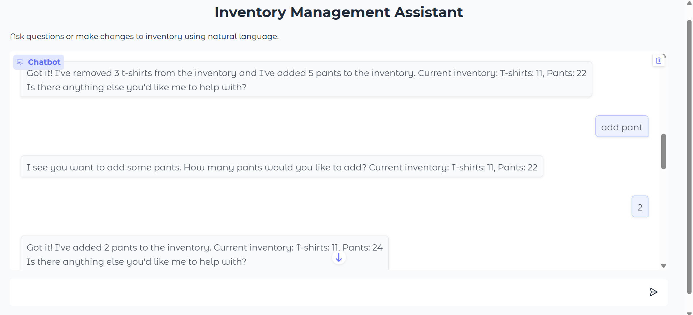
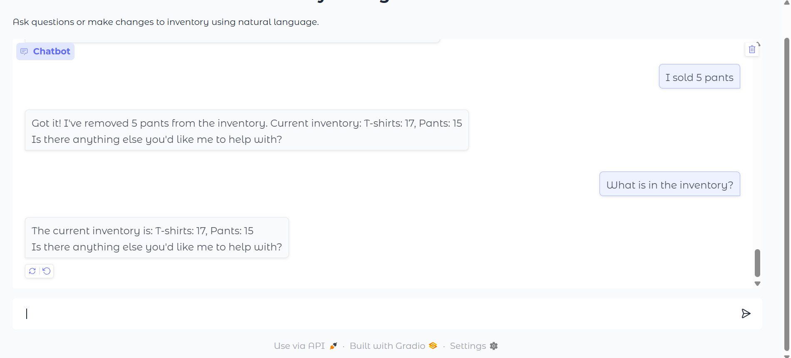

# Inventory Management System with NLP Interface

A natural language-powered inventory management system that lets you interact with inventory data using plain English. The system consists of two main components: an Inventory Service (AWS Lambda) and a Model Control Plane (MCP) Server that processes natural language.

---

## ✨ Key Features

- **Natural Language Interface**: Manage inventory using everyday English.
- **Multi-Operation Support**: Handle complex queries like "add 3 shirts and remove 2 pants."
- **Clarification System**: Intelligently asks for more information when needed.
- **Serverless Backend**: Scalable AWS Lambda-based inventory service.
- **In-Memory Storage**: Fast data access with singleton pattern implementation.
- **AI-Powered**: Uses OpenAI's GPT models for language understanding.
- **Error Handling**: Gracefully manages edge cases like insufficient inventory.
- **OpenAPI Integration**: Dynamic API discovery and specification.

## 🏗️ Project Structure
```
inventory-management-system/
├── inventory-service/              # Serverless inventory API
│   ├── src/inventory/app.py        # Lambda function handler
│   ├── template.yaml               # SAM template
│   ├── samconfig.toml              # SAM configuration
│   └── openapi.yaml                # API specification
│
├── mcp-server/                     # Natural language processor
│   ├── app/
│   │   ├── __init__.py
│   │   ├── main.py                 # FastAPI application
│   │   ├── inventory.py            # Inventory client
│   │   ├── llm_service.py          # OpenAI integration
│   │   ├── openapi_parser.py       # OpenAPI spec parser
│   │   ├── auth.py                 # Authentication handling
│   │   └── utils.py                # Utility functions
│   ├── run.py                      # Server startup
│   ├── ui.py                       # Gradio UI for demo
│   ├── requirements.txt            # Python dependencies
│   └── openapi.yaml                # Copy of API specification
│
├── openapi.yaml                    # API specification
└── README.md                       # Project documentation
```

## 📋 Requirements

- Python 3.9+
- AWS Account with configured credentials
- AWS CLI
- AWS SAM CLI
- OpenAI API Key
- FastAPI and Uvicorn
- httpx for async HTTP requests
- pydantic for data validation
- gradio (for optional UI)

## 🛠️ Technologies Used

- **Backend**: Python 3.9+, FastAPI, AWS Lambda, AWS API Gateway, AWS SAM
- **Natural Language Processing**: OpenAI GPT-3.5, Regular Expressions
- **API & Documentation**: OpenAPI 3.0, YAML
- **Development Tools**: httpx, pydantic, python-dotenv, uvicorn, gradio

---

## 🧠 Design Approach

- **Serverless Architecture**: For scalability and cost-efficiency.
- **Singleton Pattern**: For in-memory data storage as required by the project.
- **Hybrid NLP Approach**: Regex for common queries and OpenAI GPT for complex phrasings.
- **Clarification System**: Handles ambiguous queries.
- **OpenAPI Integration**: For dynamic API discovery and specification.
- **Modular Design**: Separation of concerns with dedicated modules.

---

## 📝 Limitations & Future Improvements

- **Data Persistence**: Currently uses in-memory storage; could be extended with a database like DynamoDB.
- **Limited Items**: Only tracks t-shirts and pants as specified; can be expanded.
- **Authentication**: Basic implementation that could be enhanced for production use.
- **Testing**: Could be expanded with comprehensive unit and integration tests.

## 📦 Installation & Setup

### Prerequisites

Before starting, ensure you have the following installed:
- Python 3.9+
- [AWS CLI](https://aws.amazon.com/cli/) (configured with your credentials)
- [AWS SAM CLI](https://docs.aws.amazon.com/serverless-application-model/latest/developerguide/serverless-sam-cli-install.html)
- An OpenAI API key

### Step 1: Clone the Repository

```bash
git clone https://github.com/shereenjohn/inventory-management-system.git
cd inventory-management-system
```
### Step 2: Deploy the Inventory Service
```bash
cd inventory-service

# Build the SAM application

sam build

# Deploy to AWS

sam deploy --guided
```
Follow the prompts during guided deployment:

Stack Name: inventory-service
AWS Region: Your preferred region
Confirm changes before deployment: Y
Allow SAM CLI to create IAM roles: Y

Important: Note the API endpoint URL from the deployment output. You'll need this for the MCP server.

### Step 3: Set Up the MCP Server
```bash
cd ../mcp-server

# Install dependencies
pip install -r requirements.txt

# Create .env file with your configuration
# Replace with your actual API URL and OpenAI key
echo "INVENTORY_API_URL=your_api_url" > .env
echo "OPENAI_API_KEY=your_openai_api_key" >> .env

# If using authentication (optional)
echo "COGNITO_TOKEN=your_cognito_token" >> .env
echo "COGNITO_REFRESH_TOKEN=your_refresh_token" >> .env
echo "COGNITO_CLIENT_ID=your_client_id" >> .env
echo "COGNITO_USER_POOL_ID=your_user_pool_id" >> .env
echo "COGNITO_ENDPOINT=https://cognito-idp.us-east-1.amazonaws.com/" >> .env
echo "AWS_REGION=us-east-1" >> .env

# Start the server
python run.py
```
### Step 4: Start the UI 
```bash
# In a separate terminal
cd mcp-server
python ui.py

# Access UI at http://localhost:7860
```
🖥️ Usage Examples

Natural Language Queries
You can interact with the system using queries like:

"What is in the inventory?"
"Add 5 pants"
"sold 3 shirts"
"Add 2 shirts and remove 1 pant"
"+5 t-shirts, -3 pants"






